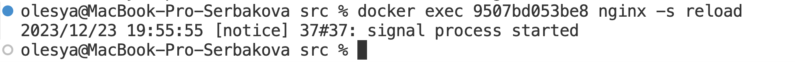

### Simple Docker

#### Part 1. Ready-made docker
##### Take the official docker image from nginx and download it using docker pull.

##### Check for the docker image with docker images

##### Run docker image with docker run -d [image_id|repository]

##### Check that the image is running with docker ps

##### View container information with docker inspect [container_id|container_name]

##### From the command output define and write in the report the container size, list of mapped ports and container ip

##### Stop docker image with docker stop [container_id|container_name]

##### Check that the image has stopped with docker ps

##### Run docker with ports 80 and 443 in container, mapped to the same ports on the local machine, with run command

##### Check that the nginx start page is available in the browser at localhost:80

##### Restart docker container with docker restart [container_id|container_name]

Check in any way that the container is running

Add the following screenshots to the report:
the call and output of all commands used in this part of the task;
nginx start page at localhost:80 (address must be shown).

#### Part 2. Operations with container

##### Read the nginx.conf configuration file inside the docker container with the exec command

##### Create a nginx.conf file on a local machine

##### Configure it on the /status path to return the nginx server status page

##### Copy the created nginx.conf file inside the docker image using the docker cp command

##### Restart nginx inside the docker image with exec

##### Check that localhost:80/status returns the nginx server status page

##### Export the container to a container.tar file with the export command

##### Stop the container

##### Delete the image with docker rmi [image_id|repository]without removing the container first

##### Delete stopped container

##### Import the container back using the import command

##### Run the imported container

##### Check that localhost:80/status returns the nginx server status page

#### Part 3. Mini web server

##### Write a mini server in C and FastCgi that will return a simple page saying Hello World!

#### Run the written mini server via spawn-fcgi on port 8080
#### Write your own nginx.conf that will proxy all requests from port 81 to 127.0.0.1:8080

###### docker run -d -p 81:81 nginx

###### docker cp nginx.conf (to container) admiring_nightingale:/etc/nginx
###### docker cp mini_web_server.c admiring_nightingale:/home  

###### sudo docker exec -it admiring_nightingale bash (open bash session on container - root@107641ef5ba0)

###### apt-get install -y gcc spawn-fcgi libfcgi-dev, apt-get update

###### gcc -o /home/mini_web_server /home/mini_web_server.c -lfcgi (gcc on container)
###### spawn-fcgi -p 8080 ./home/mini_web_server (run)

###### `spawn-fcgi` is a tool used for spawning FastCGI processes. FastCGI (Fast Common Gateway Interface) is a protocol that enables a web server to communicate with external applications or processes to handle dynamic content, such as processing scripts written in languages like PHP, Python, or Ruby.
###### The `spawn-fcgi` tool is commonly used with web servers like Nginx to manage and launch FastCGI processes. It helps in setting up and managing the execution environment for FastCGI applications, making it easier to integrate them with a web server.

###### reload (restart)

##### Check that browser on localhost:81 returns the page you wrote

##### Put the nginx.conf file under ./nginx/nginx.conf (you will need this later)
##### exit from session bash container

#### Part 4. Your own docker
##### A `Dockerfile` is a script or a configuration file used to build a Docker image. It contains a set of instructions that define the steps needed to create a Docker image, which is a lightweight, portable, and self-sufficient unit that can run applications in isolated environments called containers.
- FROM: Specifies the base image from which you are building. It typically includes an operating system and any necessary dependencies.
- WORKDIR: Sets the working directory inside the container. Subsequent instructions will be executed in this directory.
- COPY: Copies files from the host machine to the container. It is used to include application code and configuration files.
-RUN: Executes commands during the image build process. It is commonly used to install software packages or perform configuration tasks.

##### Write your own docker image that:

1) builds mini server sources on FastCgi from [Part 3](#part-3-mini- web-server)

2) runs it on port 8080

3) copies inside the image written ./nginx/nginx.conf

4) runs nginx.

##### Build the written docker image with docker build, specifying the name and tag
##### Check with docker images that everything is built correctly

##### Run the built docker image by mapping port 81 to 80 on the local machine and mapping the ./nginx folder inside the container to the address where the nginx configuration files are located (see Part 2)

##### Check that the page of the written mini server is available on localhost:80

##### Add proxying of /status page in ./nginx/nginx.conf to return the nginx server status

##### Restart docker image

##### Check that localhost:80/status now returns a page with nginx status

#### Part 5. Dockle

##### Check the image from the previous task with dockle [image_id|repository]

##### Fix the image so that there are no errors or warnings when checking with dockle

#### Part 6. Basic Docker Compose
officional docs:
https://docs.docker.com/compose/reference/
##### Write a docker-compose.yml file, using which:

A `docker-compose.yml` file is a YAML configuration file used with Docker Compose, a tool for defining and running multi-container Docker applications. The docker-compose.yml file defines the services, networks, and volumes for a Docker application, allowing you to configure and run multiple containers as a single application.

1) Start the docker container from Part 5 (it must work on local network, i.e., you don't need to use EXPOSE instruction and map ports to local machine)

2) Start the docker container with nginx which will proxy all requests from port 8080 to port 81 of the first container

Check that the browser returns the page you wrote on localhost:80 as before
